---
## Front matter
title: "Отчёт по лабораторной работе №4"
subtitle: "Дисциплина: Архитектура компьютеров"
author: "Захаров Кирилл Юрьевич"
---

# Цель работы {#цель-работы-1}

Цель данной лабораторной работы заключается в изучении и овладении
процедурами компиляции и сборки программ, созданных с использованием
ассемблера NASM.

# Выполнение лабораторной работы

## Программа Hello world!

С помощью утилиты cd перемещаюсь в каталог, в котором буду работать
(рис. 01).

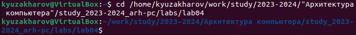{width=100%}

Создаю в текущем каталоге пустой текстовый файл hello.asm с помощью
утилиты touch (рис. 02).

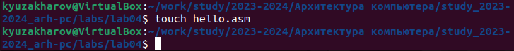{width=100%}

Открываю созданный файл в текстовом редакторе через консоль (рис. 03).

{width=100%}

Заполняю файл, вставляя в него программу для вывода "Hello word!". Так,
как ассемблер не является высокоуровневым языком, каждая команда
размещается на отдельной строке, так же обращаю внимание на регистр, так
как Assembly чувствителен к нему. (рис. 04).

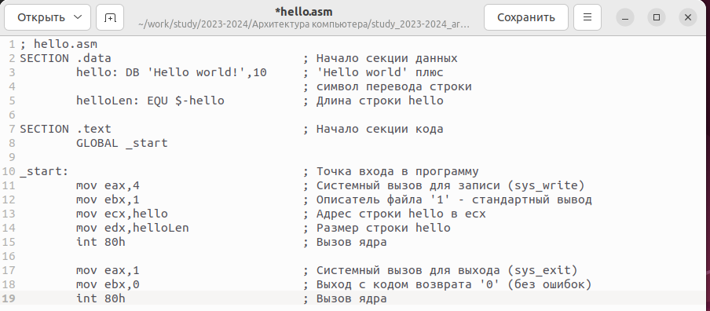{width=100%}

## Транслятор NASM

Превращаю текст программы для вывода "Hello world!" в объектный код с
помощью транслятора NASM, используя команду nasm -f elf hello.asm, ключ
-f указывает транслятору nasm, что требуется создать бинарный файл в
формате ELF (рис. 05). Далее проверяю правильность выполнения команды с
помощью утилиты ls: действительно, создан файл "hello.o".

{width=100%}

## Расширенный синтаксис командной строки NASM

Ввожу команду, которая скомпилирует файл hello.asm в файл obj.o,
использую ключ -o который задает имя объектному файлу, так же в файл
будут включены символы для отладки (ключ -g), с помощью ключа -l будет
создан файл листинга list.lst (рис. 06). Далее проверяю с помощью
утилиты ls правильность выполнения команды (рис. 07).

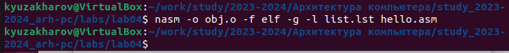{width=100%}

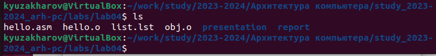{width=100%}

## Компоновщик LD

Передаю объектный файл hello.o на обработку компоновщику LD, чтобы
получить исполняемый файл hello (рис. 08). Ключ -о задает имя
создаваемого исполняемого файла. Далее проверяю с помощью утилиты ls
правильность выполнения команды (рис. 09).

{width=100%}

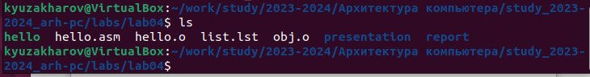{width=100%}

Выполняю следующую команду (рис. 10). Исполняемый файл будет иметь имя
main, т.к. после ключа -о было задано значение main. Объектный файл, из
которого собран этот исполняемый файл, имеет имя obj.o

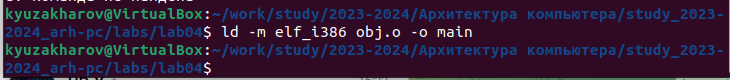{width=100%}

## Запуск исполняемого файла

Запускаю на выполнение созданный исполняемый файл hello (рис. 11).

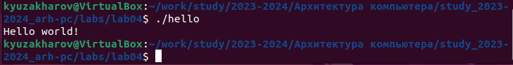{width=100%}

## Задание для самостоятельной работы.

С помощью утилиты cp создаю в текущем каталоге копию файла hello.asm с
именем lab4.asm (рис. 12).

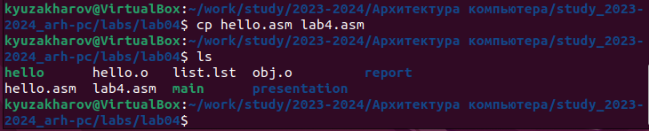{width=100%}

С помощью текстового редактора открываю файл lab4.asm и вношу изменения
в программу так, чтобы она выводила мои имя и фамилию. (рис. 13).

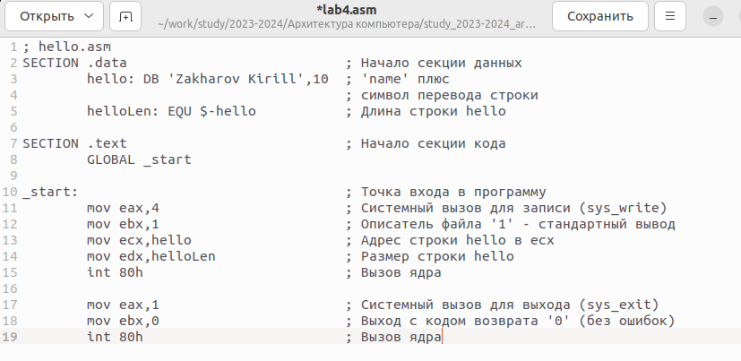{width=100%}

Компилирую текст программы в объектный файл (рис. 14). Проверяю с
помощью утилиты ls, что файл lab4.o создан.

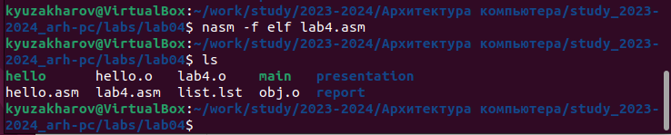{width=100%}

Передаю объектный файл lab4.o на обработку компоновщику LD, чтобы
получить исполняемый файл lab4 (рис. 15).

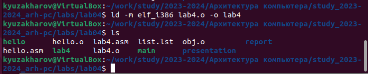{width=100%}

Запускаю исполняемый файл lab4, на экран действительно выводятся мои имя
и фамилия (рис. 16).

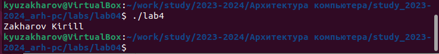{width=100%}

Отправляю файлы на сервер с помощью команды git push (рис. 17).

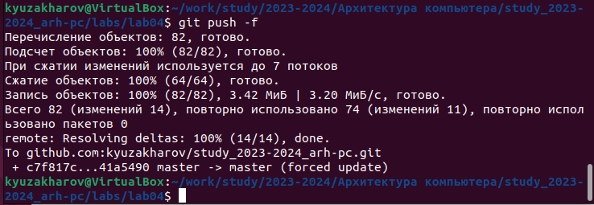{width=100%}

# Выводы

В результате выполнения данной лабораторной работы мы овладели
процедурами компиляции и сборки программ, написанных на ассемблере NASM.
Эти навыки позволят нам эффективно работать с программами на ассемблере
и улучшить навыки низкоуровневого программирования. Мы также научились
использовать инструменты для компиляции и сборки программ, что важно для
разработки программного обеспечения.
