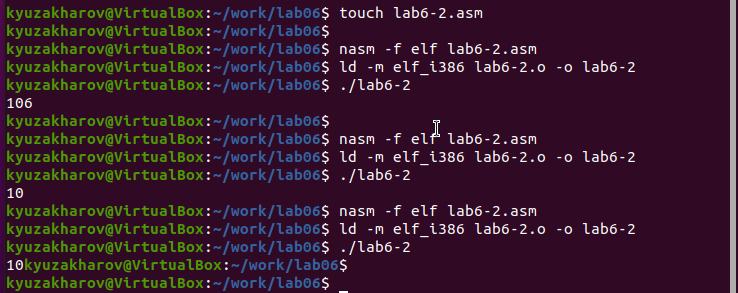

---
## Front matter
title: "Отчёт по лабораторной работе №6"
subtitle: "Дисциплина: архитектура компьютера"
author: "Захаров Кирилл Юрьевич"

## Generic otions
lang: ru-RU
toc-title: "Содержание"

## Bibliography
bibliography: bib/cite.bib
csl: pandoc/csl/gost-r-7-0-5-2008-numeric.csl

## Pdf output format
toc: true # Table of contents
toc-depth: 2
lof: true # List of figures
lot: true # List of tables
fontsize: 12pt
linestretch: 1.5
papersize: a4
documentclass: scrreprt
## I18n polyglossia
polyglossia-lang:
  name: russian
  options:
	- spelling=modern
	- babelshorthands=true
polyglossia-otherlangs:
  name: english
## I18n babel
babel-lang: russian
babel-otherlangs: english
## Fonts
mainfont: PT Serif
romanfont: PT Serif
sansfont: PT Sans
monofont: PT Mono
mainfontoptions: Ligatures=TeX
romanfontoptions: Ligatures=TeX
sansfontoptions: Ligatures=TeX,Scale=MatchLowercase
monofontoptions: Scale=MatchLowercase,Scale=0.9
## Biblatex
biblatex: true
biblio-style: "gost-numeric"
biblatexoptions:
  - parentracker=true
  - backend=biber
  - hyperref=auto
  - language=auto
  - autolang=other*
  - citestyle=gost-numeric
## Pandoc-crossref LaTeX customization
figureTitle: "Рис."
tableTitle: "Таблица"
listingTitle: "Листинг"
lofTitle: "Список иллюстраций"
lotTitle: "Список таблиц"
lolTitle: "Листинги"
## Misc options
indent: true
header-includes:
  - \usepackage{indentfirst}
  - \usepackage{float} # keep figures where there are in the text
  - \floatplacement{figure}{H} # keep figures where there are in the text
---

# Цель работы

Целью работы является освоение арифметических инструкций языка ассемблера NASM.

# Выполнение лабораторной работы

## Символьные и численные данные в NASM

Я создал папку для хранения файлов лабораторной работы номер шесть, перешел в нее и сформировал файл с названием lab6-1.asm. (рис. [-@fig:001])

{ #fig:001 width=70%, height=70% }

Давайте изучим примеры программ, которые выполняют вывод символов и числовых данных. Эти программы будут отображать данные, которые хранятся в регистре eax.

{ #fig:002 width=70%, height=70% }

В одной из таких программ в регистр eax помещается символ '6' (используя команду mov eax, '6'), а в регистр ebx помещается символ '4' (mov ebx, '4'). Затем мы складываем значения регистров eax и ebx (выполняем команду add eax, ebx, и результат сложения сохраняется в регистре eax). 
После этого мы производим вывод результата. (рис. [-@fig:002]) (рис. [-@fig:003])

{ #fig:003 width=70%, height=70% }

Так как функция sprintLF требует, чтобы в регистре eax находился адрес, нам нужно ввести вспомогательную переменную. Мы передадим значение из регистра eax в переменную buf1 (с помощью команды mov [buf1], eax), после чего поместим адрес переменной buf1 обратно в регистр eax (команда mov eax, buf1) и вызовем функцию sprintLF.

При выводе содержимого регистра eax мы ожидаем получить значение 10. Тем не менее, на экране появится символ 'j'. Это объясняется тем, что двоичный код для символа '6' составляет 00110110, что в десятичной системе соответствует числу 54, а для символа '4' двоичный код - 00110100, или 52 в десятичном исчислении. Когда выполняется команда add eax, ebx, в регистр eax записывается их сумма, равная 01101010 в двоичном формате, или 106 в десятичном, что соответствует коду символа 'j'.

Затем я изменил текст программы, заменив символы на числа для записи в регистры. (рис. [-@fig:004]) (рис. [-@fig:005])

{ #fig:004 width=70%, height=70% }

{ #fig:005 width=70%, height=70% }

Как и в прошлый раз, при выполнении программы мы не увидим цифру 10. В этом случае на экран выводится символ с кодом 10, который является символом новой строки (или возвратом каретки). В консоли он не виден, но добавляет пустую строку.

Как уже упоминалось, в файле in_out.asm имеются вспомогательные функции для конвертации символов ASCII в числа и наоборот. Используя эти функции, я модифицировал текст программы. (рис. [-@fig:006]) (рис. [-@fig:007])

{ #fig:006 width=70%, height=70% }

{ #fig:007 width=70%, height=70% }

Теперь программа выдаст число 106. В этом случае, так же как и в первом примере, команда add суммирует коды символов '6' и '4' (54+52=106). Но в отличие от предыдущей программы, функция iprintLF позволяет отобразить именно число, а не символ с соответствующим числовым кодом.

Таким же образом, как и в предыдущем примере, заменяем символы на числа. (рис. [-@fig:008])

{ #fig:008 width=70%, height=70% }

Функция iprintLF дает возможность вывода числа, и поскольку в качестве операндов использовались числа (не коды символов), результатом является число 10. (рис. [-@fig:009])

{ #fig:009 width=70%, height=70% }

Затем я заменил функцию iprintLF на iprint, создал исполняемый файл и запустил его. Результат отличается отсутствием переноса строки после вывода. (рис. [-@fig:010])

{ #fig:010 width=70%, height=70% }

## Выполнение арифметических операций в NASM

Давайте рассмотрим пример выполнения арифметических действий в NASM на основе 
программы, которая рассчитывает значение функции $$f(x) = (5 * 2 + 3)/3$$.
(рис. [-@fig:011]) (рис. [-@fig:012])

{ #fig:011 width=70%, height=70% }

{ #fig:012 width=70%, height=70% }

Я изменил код программы таким образом, чтобы она теперь вычисляла новое выражение $$f(x) = (4 * 6 + 2)/5$$, 
после чего собрал исполняемый файл и проверил его функционирование. 
(рис. [-@fig:013]) (рис. [-@fig:014])

{ #fig:013 width=70%, height=70% }

{ #fig:014 width=70%, height=70% }

Дополнительный пример демонстрирует программу для расчета индивидуального задания, 
основанного на номере студенческого билета. (рис. [-@fig:015]) (рис. [-@fig:016])

В этой ситуации число для операций вводится через клавиатуру. Напомним, что ввод осуществляется в текстовом формате, и для того чтобы арифметические операции в NASM работали правильно, текстовые символы необходимо конвертировать в числовые значения. В этом может помочь функция atoi из файла in_out.asm.

{ #fig:015 width=70%, height=70% }

{ #fig:016 width=70%, height=70% }

### Ответы на вопросы

1. Какие строки листинга отвечают за вывод на экран сообщения ‘Ваш вариант:’?

- Команда `mov eax, rem` загружает в регистр значение, содержащее фразу "Ваш вариант:".

- Используя `call sprint`, происходит вызов функции, которая отображает строку на экране.

2. Для чего используются следующие инструкции?

- `mov ecx, x` помещает значение в регистр `ecx`.

- `mov edx, 80` устанавливает в регистр `edx` значение 80.

- `call sread` активирует функцию чтения данных, которая запрашивает ввод студенческого билета и сохраняет его в переменную `X`.

3. Для чего используется инструкция "call atoi"?

- Эта функция конвертирует строку символов в их численное представление.

4. Какие строки листинга отвечают за вычисления варианта?

- `xor edx, edx` обнуляет регистр `edx`.

- `mov ebx, 20` устанавливает в регистр `ebx` число 20.

- `div ebx` выполняет деление, используя значение в `ebx`.

- `inc edx` увеличивает значение в регистре `edx` на единицу, что соответствует вычислению варианта.

5. В какой регистр записывается остаток от деления при выполнении инструкции "div ebx"?

- Остаток от деления помещается в регистр `edx`.

6. Для чего используется инструкция "inc edx"?

- Команда увеличивает значение в регистре `edx` на один, что необходимо по алгоритму вычисления варианта.

7. Какие строки листинга отвечают за вывод на экран результата вычислений?

- `mov eax, edx` переносит результат вычислений в регистр `eax`.

- `call iprintLF` вызывает функцию вывода числа на экран с переводом строки.

##  Задание для самостоятельной работы

Написать программу вычисления выражения y = f(x). Программа должна выводить выражение 
для вычисления, выводить запрос на ввод значения x, 
вычислять заданное выражение в зависимости от введенного x, выводить результат вычислений. 
Вид функции f(x) выбрать из таблицы 6.3 вариантов заданий в соответствии с номером 
полученным при выполнении лабораторной работы. (рис. [-@fig:017]) (рис. [-@fig:018])
Создайте исполняемый файл и проверьте его работу для значений x1 и x2 из 6.3.

Получили вариант 15 - $$(5 + x)^2 - 3$$  для $$x=5, x=1$$

{ #fig:017 width=70%, height=70% }

{ #fig:018 width=70%, height=70% }

# Выводы

Изучили работу с арифметическими операциями.